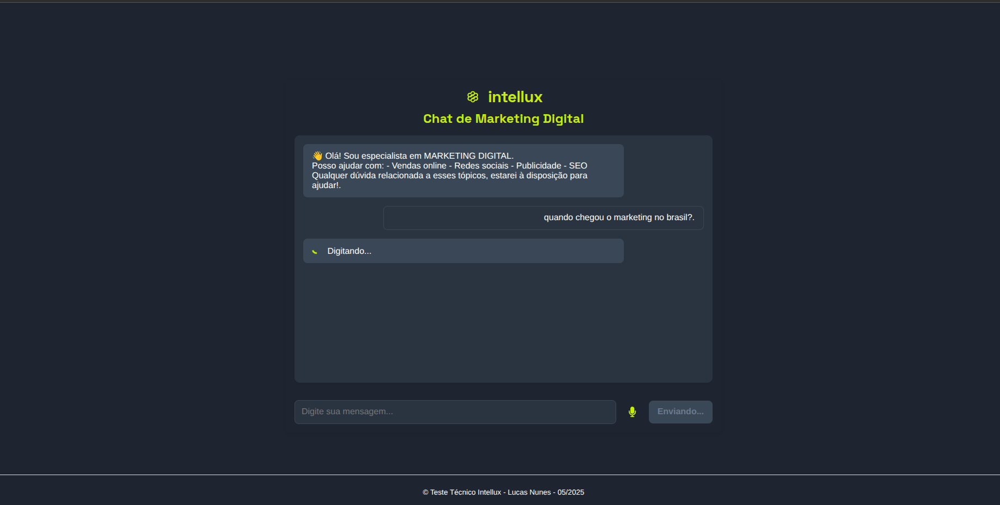
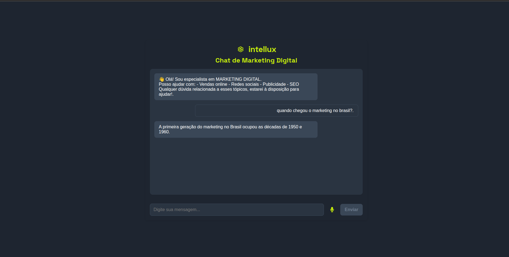

## Demonstração do Funcionamento

### Interface Principal


### Fluxo de Conversação

# 🤖 Marketing Assistant – Chatbot de Marketing Digital

Este projeto é um **chatbot inteligente especializado em marketing digital**, desenvolvido com:

- **Backend em Python** usando FastAPI, Langchain, Ollama e busca com DuckDuckGo
- **Frontend com React e Vite** para uma interface interativa
- **RAG (Retrieval-Augmented Generation)**: respostas com base em LLM e fontes externas

---

## 🧠 Funcionalidades

- Geração de respostas contextualizadas sobre marketing digital
- Recuperação de contexto em tempo real (via DuckDuckGo)
- Validação de perguntas para garantir que o conteúdo seja relevante
- Histórico de mensagens (chat memory)
- Interface gráfica com React + Vite
- API pública com Swagger
- Testes unitários com `pytest` e dependências mockadas

---

## 🧰 Tecnologias

### Backend

- **Python 3.11+**
- <a href="https://fastapi.tiangolo.com/" target="_blank" rel="noopener noreferrer">FastAPI</a>
- <a href="https://www.langchain.com/" target="_blank" rel="noopener noreferrer">Langchain</a>
- <a href="https://ollama.com/library/gemma:2b" target="_blank" rel="noopener noreferrer">Ollama + Gemma 2B</a>
- <a href="https://pypi.org/project/duckduckgo-search/" target="_blank" rel="noopener noreferrer">DuckDuckGo Search</a>
- <a href="https://docs.pytest.org/" target="_blank" rel="noopener noreferrer">Pytest</a>

### Frontend

- **React 18**
- <a href="https://vitejs.dev/" target="_blank" rel="noopener noreferrer">Vite</a>
- TypeScript
- CSS customizado
---

## 🗂 Estrutura do Projeto

```

├── app/                        # Backend (FastAPI)
 │   ├── api/                   # Endpoints da API
 │   ├── chatbot/               # Lógica do fluxo de conversas
 │   ├── database/ # Conexão com PostgreSQL
 │   └── database.py # Script de conexão/configuração
 │   ├── llm/                   # Integração com LLM via Langchain
 │   ├── prompt/                # Definição do comportamento inicial do bot
 │   ├── retrieve/              # Recuperação de contexto via DuckDuckGo
 │   ├── validators/            # Validação de perguntas
 │   └── tests/                 # Testes unitários com mocks
 │
 ├── frontend/                  # Frontend (React + Vite)
 │   └── fe-marketing-assistant/
 │       ├── src/
 │       │   ├── assets/        # Logotipo
 │       │   ├── components/    # Onde estão o ChatPage.tsx e VoiceInput.tsx
 │       │   ├── types/         # Onde está a interface pro VoiceInput
 │       │   ├── App.tsx        # Onde o componente principal é renderizado
 │       │   ├── index.css      # Estilos globais
 │       │   └── main.tsx       # Ponto de entrada do front
 │
 ├── requirements.txt           # Dependências do backend
 └── README.md                  # Documentação do projeto
 ```

---

## 📦 Instalação

### 🔙 Backend (FastAPI + Langchain + Ollama)

1. Clone o repositório e crie um ambiente virtual:

```bash
git clone https://github.com/seu-usuario/marketing-assistant.git
cd marketing-assistant
python -m venv .venv
source .venv/bin/activate  # Linux/macOS
.venv\Scripts\activate     # Windows

Instale as dependências:

pip install -r requirements.txt

Inicie o Ollama com o modelo gemma:2b:

ollama run gemma:2b

Inicie a API (modo dev):

uvicorn app.api.main:app --reload

Acesse a documentação da API em:
📍 http://localhost:8000/docs

 ```

🖥️ **Frontend**(React + Vite)

   ```

    Acesse a pasta frontend:

cd frontend

    Instale as dependências:

npm install

    Execute o servidor de desenvolvimento:

npm run dev

A interface estará em:
📍 http://localhost:3000

 ```


💬 **Como funciona?**

    O frontend carrega uma mensagem inicial via GET /info

    O usuário envia uma pergunta → enviada para o backend via POST /chat

    O backend:

        Valida se a pergunta é sobre marketing

        Busca contexto com DuckDuckGo (RAG)

        Usa o modelo Gemma (via Ollama) para gerar uma resposta

    A resposta é retornada e exibida no chat

🧪 **Testes**

Execute os testes do backend com:
 ```
pytest
 ```

Os testes usam mocks e fakes, evitando chamadas reais ao LLM e à internet.